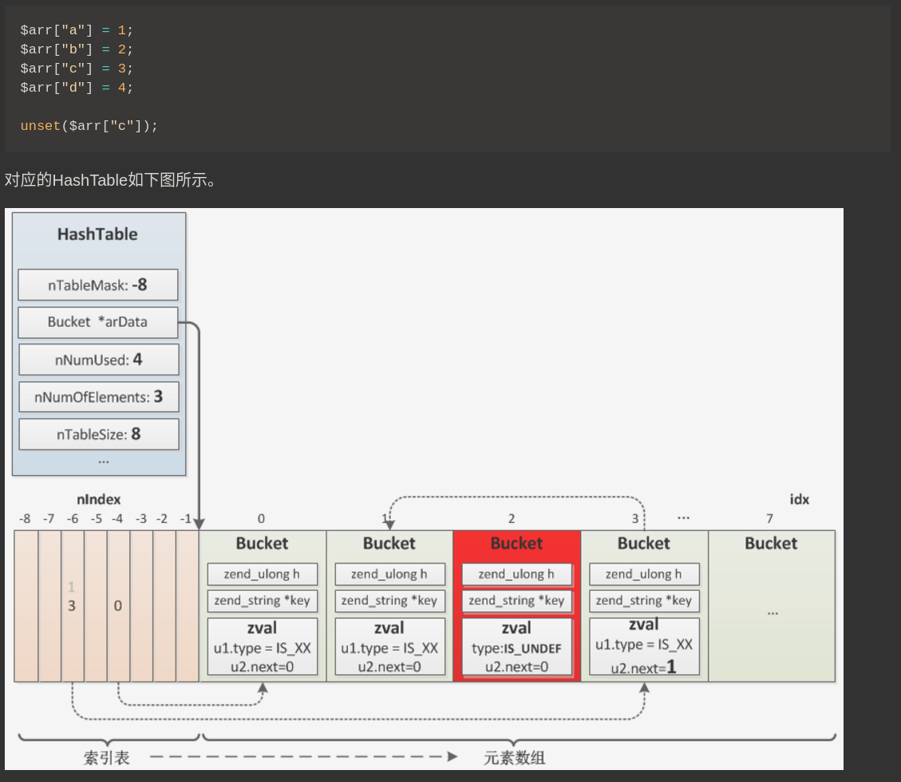

## 数组/哈希表

### 数组结构
```c
/* Zend/zend_type.h */

typedef struct _zend_array HashTable;
//这个结构体64位平台占56个字节.
struct _zend_array {
	zend_refcounted_h gc;	//引用计数信息,与字符串相同
	union {
		struct {
			ZEND_ENDIAN_LOHI_4(
				zend_uchar    flags,//zend_hash.h:line 38
				zend_uchar    nApplyCount,//数组循环递归保护
				zend_uchar    nIteratorsCount,//数组迭代深度
				zend_uchar    consistency)//一致性状态 zend_hash.c line 38
		} v;
		uint32_t flags;	//标志位
	} u;
	uint32_t          nTableMask;		//计算bucket索引时的掩码,等于nTableSize的负值(nTableMask = -nTableSize)
	Bucket            *arData;			//指向 Bucket 类型数据的指针,插入时只会在 arData 数组的结尾插入,而不会填充已经被删除的节点.
	uint32_t          nNumUsed;			//arData数组已经使用bucket数,每当添加一个新的数据时,此成员会加1.
	uint32_t          nNumOfElements;	//有效bucket数,nNumOfElements <= nNumUsed,因为删除的并不是直接从arData中移除
	uint32_t          nTableSize;		//hash表的大小,为2^n
	uint32_t          nInternalPointer;	//数值索引,用于HashTable遍历
	zend_long         nNextFreeElement;	//下一个空闲可用位置的数字索引
	dtor_func_t       pDestructor;		//析构函数,销毁时调用的函数指针
};
typedef struct _Bucket {
	zval              val;
	zend_ulong        h;                /* hash value (or numeric index)   */
	zend_string       *key;             /* string key or NULL for numerics */
} Bucket;

//引用结构
typedef struct _zend_refcounted_h {
	uint32_t         refcount;			/* reference counter 32-bit */
	union {
		struct {
			ZEND_ENDIAN_LOHI_3(
				zend_uchar    type,		//zend_value的类型,与zval.u1.type一致
				zend_uchar    flags,    /* line:438  used for strings & objects */
				uint16_t      gc_info)  /* GC信息,垃圾回收的过程会用到  keeps GC root number (or 0) and color */
		} v;
		uint32_t type_info;
	} u;
} zend_refcounted_h;
```

zval.value.arr将指向上面的这样的一个结构体, 由它实际保存一个数组, 引用计数部分保存在zend_refcounted_h结构中:

所有的复杂类型的定义, 开始的时候都是zend_refcounted_h结构, 这个结构里除了引用计数以外, 还有GC相关的结构. 从而在做GC回收的时候, GC不需要关心具体类型是什么, 所有的它都可以当做zend_refcounted*结构来处理.

插入元素时按顺序 依次插入数组,比如第一个元素在arData[0]、第二个在arData[1]...arData[nNumUsed].


### 数据结构图片

当我们分配完整的arData内存时,会通过公式`tablesize * sizeof(bucket) + tablesize * sizeof(uint32)`计算它的大小



### 监视EG,CG,PG全局变量


### hash映射函数,碰撞处理
hash表背后的概念非常简单:字符串键通过散列函数运行,该函数返回一个整数.然后,该整数用作“正常”数组的索引.问题是两个不同的字符串可能导致相同的哈希,因为可能的字符串的数量实际上是无限的,而散列受整数大小的限制.这样的hash表需要实现某种碰撞解决机制->链表法.

生成hash值:DJBX33A算法
Zend/zend_string.h : line 325


### hashtable的操作

```c
/*
ht: 数组地址HashTable*,如果内部使用可以直接通过emalloc分配
nSize: 初始化大小,只是参考值,这个值会被对齐到2^n,最小为8
pHashFunction: 无用,设置为NULL即可
pDestructor: 删除或更新数组元素时会调用这个函数对操作的元素进行处理,比如将一个字符串插入数组,字符串的refcount增加,删除时不是简单的将元素的Bucket删除就可以了,还需要对其refcount进行处理,这个函数就是进行清理工作的
persistent: 是否持久化
*/
//hash初始化
ALLOC_HASHTABLE(ht);
zend_hash_init(ht, nSize, pHashFunction, pDestructor, persistent);
//添加元素
	//key为zend_string
		zend_hash_update(ht, key, pData)    //插入或更新元素,会增加key的refcount
		zend_hash_update_ind(ht, key, pData)//插入或更新元素,当Bucket类型为indirect时,将pData更新至indirect的值,而不是更新Bucket
		zend_hash_add(ht, key, pData)		//添加元素,与zend_hash_update()类似,不同的地方在于如果元素已经存在则不会更新
		zend_hash_add_new(ht, key, pData)	//直接插入元素,不管key存在与否,如果存在也不覆盖原来元素,而是当做哈希冲突处理,所有会出现一个数组中key相同的情况,慎用!!!
	//key为普通字符串:char*
	//与上面几个对应,这里的key为普通字符串,会自动生成zend_string的key
		zend_hash_str_update(ht, key, len, pData)
		zend_hash_str_update_ind(ht, key, len, pData)
		zend_hash_str_add(ht, key, len, pData)
		zend_hash_str_add_new(ht, key, len, pData)
	//key为数值索引
		zend_hash_index_add(ht, h, pData)	//插入元素,h为数值
		zend_hash_index_add_new(ht, h, pData)	//zend_hash_index_add_new
		zend_hash_index_update(ht, h, pData)	//与zend_hash_add_new()类似
	//使用自动索引值
		zend_hash_next_index_insert(ht, pData)	
		zend_hash_next_index_insert_new(ht, pData)
//查找元素
	zend_hash_find(const HashTable *ht, zend_string *key);		//根据zend_string key查找数组元素
	zend_hash_str_find(const HashTable *ht, const char *key, size_t len);	//根据普通字符串key查找元素
	zend_hash_index_find(const HashTable *ht, zend_ulong h);	//获取数值索引元素
	//判断元素是否存在
	zend_hash_exists(const HashTable *ht, zend_string *key);
	zend_hash_str_exists(const HashTable *ht, const char *str, size_t len);
	zend_hash_index_exists(const HashTable *ht, zend_ulong h);	
	zend_hash_num_elements(ht)		//获取数组元素数
	zend_array_count(HashTable *ht);//与zend_hash_num_elements()类似,会有一些特殊处理
//删除元素	
	zend_hash_del(HashTable *ht, zend_string *key);	//删除key	
	zend_hash_del_ind(HashTable *ht, zend_string *key);	////与zend_hash_del()类似,不同地方是如果元素类型为indirect则同时销毁indirect的值
	zend_hash_str_del(HashTable *ht, const char *key, size_t len);
	zend_hash_str_del_ind(HashTable *ht, const char *key, size_t len);
	zend_hash_index_del(HashTable *ht, zend_ulong h);
	zend_hash_del_bucket(HashTable *ht, Bucket *p);
//销毁
zend_hash_destroy(ht);//调用所有Bucket的析构函数并释放它们
FREE_HASHTABLE(ht);
	
//遍历
	//遍历获取所有val
	zval *val;
	ZEND_HASH_FOREACH_VAL(ht, val) {
		...
	} ZEND_HASH_FOREACH_END();

	//遍历获取所有的数值索引
	#define ZEND_HASH_FOREACH_NUM_KEY(ht, _h) \
		ZEND_HASH_FOREACH(ht, 0); \
		_h = _p->h;

	//遍历获取所有的key
	#define ZEND_HASH_FOREACH_STR_KEY(ht, _key) \
		ZEND_HASH_FOREACH(ht, 0); \
		_key = _p->key;

	//上面两个的聚合
	#define ZEND_HASH_FOREACH_KEY(ht, _h, _key) \
		ZEND_HASH_FOREACH(ht, 0); \
		_h = _p->h; \
		_key = _p->key;

	//遍历获取数值索引key及value
	#define ZEND_HASH_FOREACH_NUM_KEY_VAL(ht, _h, _val) \
		ZEND_HASH_FOREACH(ht, 0); \
		_h = _p->h; \
		_val = _z;

	//遍历获取key及value
	#define ZEND_HASH_FOREACH_STR_KEY_VAL(ht, _key, _val) \
		ZEND_HASH_FOREACH(ht, 0); \
		_key = _p->key; \
		_val = _z;

	#define ZEND_HASH_FOREACH_KEY_VAL(ht, _h, _key, _val) \
		ZEND_HASH_FOREACH(ht, 0); \
		_h = _p->h; \
		_key = _p->key; \
		_val = _z;
	
```

### 数组操作
将zend_hash API与zvals一起使用通常需要自己处理zval分配和初始化。所以PHP提供了专门针对这种用例的第二组API。也就是array api。

| PHP语法                    | C语法(arr是zval*）                       | 作用                                 |
| --------                  | -----                                   | -----                               |
| $arr = array();           | array_init(arr);                        | 初始化一个新数组                       |
| $arr[] = NULL;	        | add_next_index_null(arr);		          | 向数字索引的数组增加指定类型的值          |
| $arr[] = 42;		        | add_next_index_long(arr, 42);           |                                     |
| $arr[] = true;		    | add_next_index_bool(arr, 1);	    	  |                                     |
| $arr[] = 3.14;		    | add_next_index_double(arr, 3.14);	      |                                     |
| $arr[] = 'foo';		    | add_next_index_string(arr, "foo", 1);	  |                                     |
| $arr[] = $myvar;	        | add_next_index_zval(arr, myvar);	      |                                     |
| $arr[0] = NULL;		    | add_index_null(arr, 0);	              | 向数组中指定的数字索引增加指定类型的值    |
| $arr[1] = 42;		        | add_index_long(arr, 1, 42);	          |                                     |
| $arr[2] = true;		    | add_index_bool(arr, 2, 1);              |	                                    |
| $arr[3] = 3.14;		    | add_index_double(arr, 3, 3.14);         |	                                    |
| $arr[4] = 'foo';	        | add_index_string(arr, 4, "foo", 1);     |	                                    |
| $arr[5] = $myvar;	        | add_index_zval(arr, 5, myvar);	      |                                     |
| $arr['abc'] = NULL;	    | add_assoc_null(arr, "abc");	          |                                     |
| $arr['def'] = 711;	    | add_assoc_long(arr, "def", 711);	      | 向关联索引的数组增加指定类型的值         |
| $arr['ghi'] = true;	    | add_assoc_bool(arr, "ghi", 1);	      |                                     |
| $arr['jkl'] = 1.44;	    | add_assoc_double(arr, "jkl", 1.44);	  |                                     |
| $arr['mno'] = 'baz';      | add_assoc_string(arr, "mno", "baz", 1); |	                                    |
| $arr['pqr'] = $myvar;	    | add_assoc_zval(arr, "pqr", myvar);      |	 .    		                        |


## 字符串
```c
/*
gc: 变量引用信息,比如当前value的引用数,所有用到引用计数的变量类型都会有这个结构,3.1节会详细分析
h: 哈希值,数组中计算索引时会用到
len: 字符串长度,通过这个值保证二进制安全
val: 字符串内容,变长struct,分配时按len长度申请内存
事实上字符串又可具体分为几类:IS_STR_PERSISTENT(通过malloc分配的)、IS_STR_INTERNED(php代码里写的一些字面量,比如函数名、变量值)、IS_STR_PERMANENT(永久值,生命周期大于request)、IS_STR_CONSTANT(常量)、IS_STR_CONSTANT_UNQUALIFIED,这个信息通过flag保存:zval.value->gc.u.flags,后面用到的时候再具体分析. 
*/
struct _zend_string {
    zend_refcounted_h gc;
    zend_ulong        h;                /* hash value */
    size_t            len;
    char              val[1];
};
```
### 示例
```c
zend_string *foo, *foo2;
foo  = zend_string_init("foo", strlen("foo"), 0);
foo2 = zend_string_copy(foo); /* “foo”字符串引用数加1 */

 /* 内部字符串，“foo”字符串引用变回为1,尽管有有三个地方在使用此字符串 */
foo = zend_new_interned_string(foo);

/* foo指向内部字符串，这里释放操作没有任何作用。*/
zend_string_release(foo);

/* foo2 指向内部字符串，这里同样没有作用 */
zend_string_release(foo2);

/* 进程结束时，PHP将清理整个内部字符串空间，我们前面声明的"foo"将在此时释放  */
```
  
### 字符串的操作
```c
//创建zend_string
zend_string *zend_string_init(const char *str, size_t len, int persistent);

//字符串复制,只增加引用
zend_string *zend_string_copy(zend_string *s);

//字符串拷贝,硬拷贝
zend_string *zend_string_dup(zend_string *s, int persistent);

//将字符串按len大小重新分配,会减少s的refcount,返回新的字符串
zend_string *zend_string_realloc(zend_string *s, size_t len, int persistent);

//延长字符串,与zend_string_realloc()类似,不同的是len不能小于s的长度
zend_string *zend_string_extend(zend_string *s, size_t len, int persistent);

//截断字符串,与zend_string_realloc()类似,不同的是len不能大于s的长度
zend_string *zend_string_truncate(zend_string *s, size_t len, int persistent);

//获取字符串refcount
uint32_t zend_string_refcount(const zend_string *s);

//增加字符串refcount
uint32_t zend_string_addref(zend_string *s);

//减少字符串refcount
uint32_t zend_string_delref(zend_string *s);

//释放字符串,减少refcount,为0时销毁
void zend_string_release(zend_string *s);

//销毁字符串,不管引用计数是否为0
void zend_string_free(zend_string *s);

//比较两个字符串是否相等,区分大小写,memcmp()
zend_bool zend_string_equals(zend_string *s1, zend_string *s2);

//比较两个字符串是否相等,不区分大小写
#define zend_string_equals_ci(s1, s2) \
    (ZSTR_LEN(s1) == ZSTR_LEN(s2) && !zend_binary_strcasecmp(ZSTR_VAL(s1), ZSTR_LEN(s1), ZSTR_VAL(s2), ZSTR_LEN(s2)))

//其它宏,zstr类型为zend_string*
#define ZSTR_VAL(zstr)  (zstr)->val 	//获取字符串
#define ZSTR_LEN(zstr)  (zstr)->len 	//获取字符串长度
#define ZSTR_H(zstr)    (zstr)->h   	//获取字符串哈希值
#define ZSTR_HASH(zstr) zend_string_hash_val(zstr) //计算字符串哈希值

ZVAL_STR(zval, zstr);	//将字符串存储到zval
Z_STRVAL(zval)	//获取ZVAL中的字符串
Z_STRLEN(zval)	//获取ZVAL中的字符串长度
Z_STRHASH(zval)	//获取ZVAL中的字符串哈希值
```

php_printf():打印格式化字符串到输出流。该函数内部使用spprintf()，会执行动态分配空间并它在将其发送到SAPI输出之后释放自身。

spprintf()：
```c
#include <time.h>
char *result;
int r;
time_t timestamp = time(NULL);
r = spprintf(&result, 0, "Here is the date: %s", asctime(localtime(&timestamp)));/* result 为 "Here is the date: Thu Jun 15 19:12:51 2017\n" */
efree(result);
```
strpprintf():
```c
zend_string *result;
result = strpprintf(0, "You are using PHP %s", PHP_VERSION);
/* Do something with result */
zend_string_release(result);
```


## 参考资料:
    http://blog.jpauli.tech/2016/04/08/hashtables.html
    https://github.com/pangudashu
    http://ju.outofmemory.cn/entry/197064
	http://www.phpinternalsbook.com


