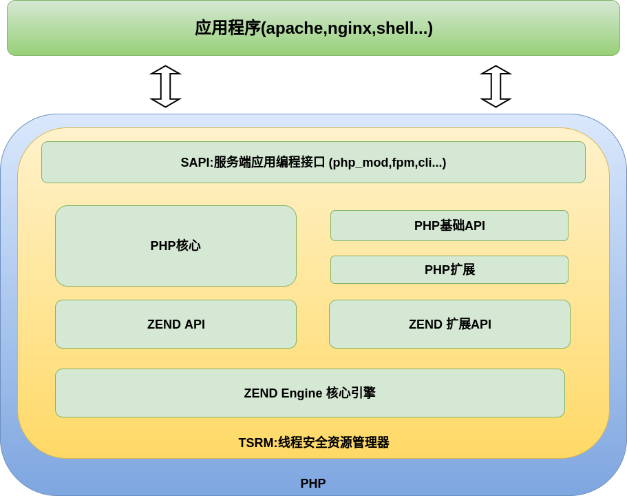
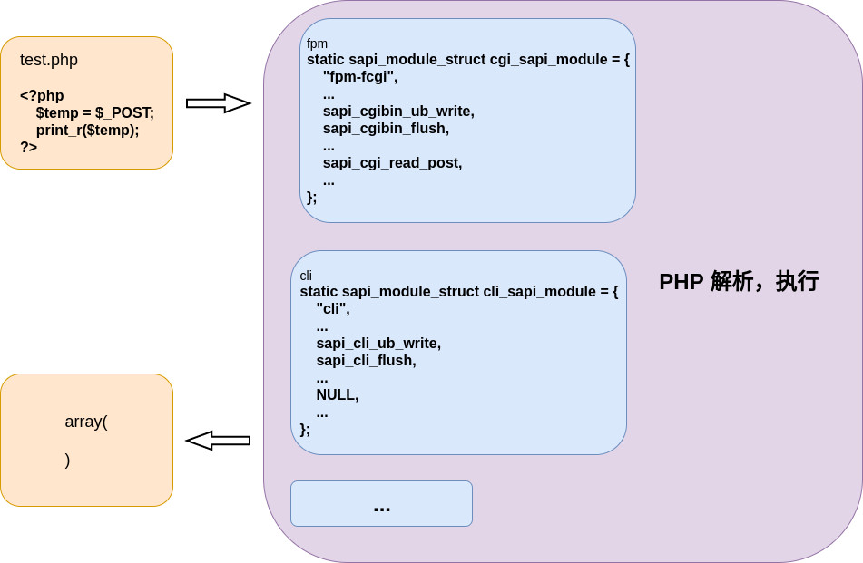

# SAPI讲解

**什么是SAPI:Server Application Programming Interface,它是PHP提供的一个接口机制,使得PHP可以和其他应用进行交互数据/协作;**

## PHP架构图


## 举例



## sapi模块结构体
```c
struct _sapi_module_struct {
	char *name;
	char *pretty_name;
    
	int (*startup)(struct _sapi_module_struct *sapi_module);//PHP被调用的时候,这个函数会被调用执行
	int (*shutdown)(struct _sapi_module_struct *sapi_module);//PHP调用结束的时候,这个函数会被调用执行

	int (*activate)(void);//每个request开始时会执行,进行一些初始化,资源分配的事务
	int (*deactivate)(void);//每个request结束时会执行

	size_t (*ub_write)(const char *str, size_t str_length);//这个hanlder告诉了Zend,如何输出数据,对于mod_php来说,这个函数提供了一个向response数据写的接口,而CLI只是简单的写到stdout
	void (*flush)(void *server_context);//这个是提供给zend的刷新缓存的函数句柄,对于CLI来说,只是简单的调用系统提供的fflush;
	zend_stat_t *(*get_stat)(void);//这部分用来让Zend可以验证一个要执行脚本文件的state,从而判断文件是否据有执行权限等等.
	char *(*getenv)(char *name, size_t name_len);//为Zend提供了一个根据name来查找环境变量的接口,对于mod_php5来说,当我们在脚本中调用getenv的时候,就会间接的调用这个句柄.CLI和CGI很类似,直接调用父级是Shell, 所以,只是简单的调用了系统提供的genenv:

	void (*sapi_error)(int type, const char *error_msg, ...) ZEND_ATTRIBUTE_FORMAT(printf, 2, 3);//错误处理函数

	int (*header_handler)(sapi_header_struct *sapi_header, sapi_header_op_enum op, sapi_headers_struct *sapi_headers);//这个函数会在我们调用PHP的header()函数的时候被调用.
	int (*send_headers)(sapi_headers_struct *sapi_headers);//这个函数会在要真正发送header的时候被调用,一般来说,就是当有任何的输出要发送之前:
	void (*send_header)(sapi_header_struct *sapi_header, void *server_context);//这个用来单独发送每一个header

	size_t (*read_post)(char *buffer, size_t count_bytes);//这个句柄指明了如何获取POST的数据,CLI是从stdin中读取POST DATA的,
	char *(*read_cookies)(void);//这个句柄指明了如何获取cookies的数据

	void (*register_server_variables)(zval *track_vars_array);//这个函数用以给$_SERVER变量中添加变量,CLI在此函数中注册了PHP_SELF,SCRIPT_FILENAME等server变量:
	void (*log_message)(char *message, int syslog_type_int);//用来输出错误信息,对于CLI来说,只是简单的输出到stderr
	double (*get_request_time)(void);//获取请求时间,只有apach2自定义了,默认为获取当前时间
	void (*terminate_process)(void);//没有任何SAPI用到,无用代码

    //STANDARD_SAPI_MODULE_PROPERTIES
	char *php_ini_path_override;
	void (*default_post_reader)(void);
	void (*treat_data)(int arg, char *str, zval *destArray);
	char *executable_location;
	int php_ini_ignore;
	int php_ini_ignore_cwd; 
	int (*get_fd)(int *fd);
	int (*force_http_10)(void);
	int (*get_target_uid)(uid_t *);
	int (*get_target_gid)(gid_t *);
	unsigned int (*input_filter)(int arg, char *var, char **val, size_t val_len, size_t *new_val_len);
	void (*ini_defaults)(HashTable *configuration_hash);
	int phpinfo_as_text;
	char *ini_entries;
	const zend_function_entry *additional_functions;
	unsigned int (*input_filter_init)(void);
};```

---

## cli_sapi_module 的定义
```c
static sapi_module_struct cli_sapi_module = {
	"cli",							/* name */
	"Command Line Interface",    	/* pretty name */

	php_cli_startup,				/* startup */
	php_module_shutdown_wrapper,	/* shutdown */
	NULL,							/* activate */
	sapi_cli_deactivate,			/* deactivate */

	sapi_cli_ub_write,		    	/* unbuffered write */
	sapi_cli_flush,				    /* flush */
	NULL,							/* get uid */
	NULL,							/* getenv */

	php_error,						/* error handler */
	sapi_cli_header_handler,		/* header handler */
	sapi_cli_send_headers,			/* send headers handler */
	sapi_cli_send_header,			/* send header handler */

	NULL,				            /* read POST data */
	sapi_cli_read_cookies,          /* read Cookies */

	sapi_cli_register_variables,	/* register server variables */
	sapi_cli_log_message,			/* Log message */
	NULL,							/* Get request time */
	NULL,							/* Child terminate */

	STANDARD_SAPI_MODULE_PROPERTIES
};
```
## 在代码中下断点定位一下调用过程


