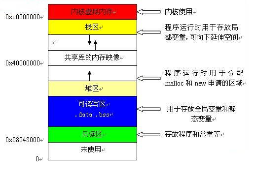
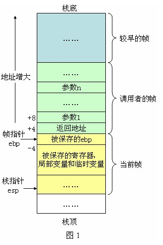

# zend执行过程
## EG变量 
executor_globals是一个全局变量,存储着许多信息(当前上下文、符号表、函数/类/常量表、堆栈等),EG宏就是用于访问executor_globals的某个成员.
```c
//zend_global.h/_zend_executor_globals
struct _zend_executor_globals {
	...
	zend_array symbol_table;		/* PHP全局变量表:$_GET,$_POST等 main symbol table */
	HashTable included_files;	/* 已经引入的脚本 files already included */

	JMP_BUF *bailout; /* try-catch保存的catch跳转位置 */
	int error_reporting;
	int exit_status;

	HashTable *function_table;	/* 全部已编译的function哈希表,包括内部函数,用户自定义函数,函数调用将从这里查找 function symbol table */
	HashTable *class_table;		/* 全部已编译的class哈希表,new class 时从此查找   class table */
	HashTable *zend_constants;	/* 常量符号表   constants table */

	zval          *vm_stack_top;//栈内存池剩余可用内存起始位置
	zval          *vm_stack_end;//栈内存池结束位置
	zend_vm_stack  vm_stack;	/* 运行栈内存池,一块空白的内存,用于分配PHP执行期间的一些数据结构(zend_execute),局部变量从这里分配 */

	struct _zend_execute_data *current_execute_data; /* 指向当前正在执行的运行栈,函数调用就是分配一个新的zend_execute_data,然后将EG(current_execute_data)指向新的结构继续执行,调用完毕再还原回去,类似汇编call,ret指令的作用  */
	zend_class_entry *fake_scope; /* used to avoid checks accessing properties */
	...

	HashTable *in_autoload;	/* 在类的自动加载过程中会使用到 */
	zend_function *autoload_func; /* 自动加载回调函数:__autoload() */
	zend_bool full_tables_cleanup;
	...

	HashTable regular_list;
	HashTable persistent_list;	/* 持久化符号表,request请求结束后不释放可以跨request共享,在php_module_shutdown()阶段清理,*/

	...
};
//zend/zend_globals_macros.h
# define EG(v) (executor_globals.v)
```

# zend_compile.h/_zend_execute_data
    zend_execute_data是执行过程中最核心的一个结构,每次函数的调用、include/require、eval等都会生成一个新的结构,它表示当前的作用域、代码的执行位置以及局部变量的分配等等,等同于机器码执行过程中stack的角色.

```c
//64位机器上,占80个字节
struct _zend_execute_data {
	const zend_op       *opline;/* 指向当前执行的opcode,初始时指向zend_op_array起始位置executed opline */
	zend_execute_data   *call;/* 当前正在调用的子函数 current call                   */
	zval                *return_value;//返回值指针
	zend_function       *func;/* 当前执行的函数自身(非函数调用时为空)executed function              */
	zval                 This;/* 这个值并不仅仅是面向对象的this,还有另外两个值也通过这个记录:call_info + num_args,分别存在zval.u1.reserved、zval.u2.num_args */
	zend_execute_data   *prev_execute_data;//调用时指向父级调用位置作用空间
	zend_array          *symbol_table;//全局变量符号表
#if ZEND_EX_USE_RUN_TIME_CACHE
	void               **run_time_cache;/* cache op_array->run_time_cache */
#endif
#if ZEND_EX_USE_LITERALS
	zval                *literals;/* 字面量数组,与func.op_array->literals相同  //cache op_array->literals*/
#endif
};
```


### 运行栈帧布局:
#### linux程序运行内存分配


#### C程序运行栈


### ZEND分配运行栈
```c
//Zend/zend_execute.c : 2094
/*
 * 栈帧布局,所有运行栈空间是同时分配的 / Stack Frame Layout (the whole stack frame is allocated at once)
 * ==================
 *
 *                             +=========================================================+
 * EG(current_execute_data) -> | zend_execute_data                                       |
 *                             +---------------------------------------------------------+
 *     EX_CV_NUM(0) ---------> | VAR[0]                                = ARG[1]          | 参数(arguments)
 *                             | ...                                                     |
 *                             | VAR[op_array->num_args-1]             = ARG[N]          |
 *							 | VAR[num_args]                         = CV[num_args]    | 局部变量(remaining CVs)
 *                             | ...                                                     |
 *                             | VAR[op_array->last_var-1]             = CV[last_var-1]  |
 *                             | VAR[op_array->last_var]               = TMP[0]          | 临时变量(TMP/VARs)
 *                             | ...                                                     |
 *                             | VAR[op_array->last_var+op_array->T-1] = TMP[T]          |
 *                             | ARG[N+1] (extra_args)                                   | 其余参数(extra arguments)
 *                             | ...                                                     |
 *                             +---------------------------------------------------------+
 */
```
#### 变量类型:
```c
//  Zend/zend_compile.h
#define IS_CONST    (1<<0)  //1
#define IS_TMP_VAR  (1<<1)  //2
#define IS_VAR      (1<<2)  //4
#define IS_UNUSED   (1<<3)  //8
#define IS_CV       (1<<4)  //16
```
* IS_CONST:字面量,编译时就可确定且不会改变的值,比如:$a = "hello~",其中字符串"hello~"就是常量
* IS_TMP_VAR:临时变量,比如:$a = "hello~" . time(),其中"hello~" . time()的值类型就是IS_TMP_VAR,再比如:$a = "123" + $b,"123" + $b的结果类型也是IS_TMP_VAR,从这两个例子可以猜测,临时变量多是执行期间其它类型组合现生成的一个中间值,由于它是现生成的,所以把IS_TMP_VAR赋值给IS_CV变量时不会增加其引用计数
* IS_VAR:PHP变量,这个很容易认为是PHP脚本里的变量,其实不是,这里PHP变量的含义可以这样理解:PHP变量是没有显式的在PHP脚本中定义的,不是直接在代码通过$var_name定义的.这个类型最常见的例子是PHP函数的返回值,再如$a[0]数组这种,它取出的值也是IS_VAR,再比如$$a这种
* IS_UNUSED:表示操作数没有用
* IS_CV:PHP脚本变量,即脚本里通过$var_name定义的变量,这些变量是编译阶段确定的,所以是compile variable,


除了分配execute_data的存储空间外,还分配了CV(compiled variable,即PHP变量)、TMP_VAR(临时变量,例如执行if (!$a) echo 'a';,就需要一个临时变量来存储!$a的结果)的存储空间.
EX宏是用于访问execute_data的成员


堆栈的结构体,堆栈的设计跟PHP 5类似:
struct _zend_vm_stack {
    zval *top; /* 指向堆栈的顶端 */
    zval *end; /* 指向堆栈的底端 */
    zend_vm_stack prev; /* 指向上一个堆栈,当前堆栈剩余空间不足时,会向内存管理器申请新的内存创建新的堆栈 */
};


#### opcode执行时使用的寄存器优化
```c
define ZEND_VM_FP_GLOBAL_REG "%r14"	//栈帧指针(frame pointer)寄存器
define ZEND_VM_IP_GLOBAL_REG "%r15"	//指令指针寄存器

register const zend_op* volatile opline __asm__(ZEND_VM_IP_GLOBAL_REG);
register zend_execute_data* volatile execute_data __asm__(ZEND_VM_FP_GLOBAL_REG);
```


## 参考资料:
    https://yangxikun.github.io/php/2016/11/04/php-7-func-call.html
    https://github.com/pangudashu/php7-internal/
	https://nikic.github.io/2017/04/14/PHP-7-Virtual-machine.html

