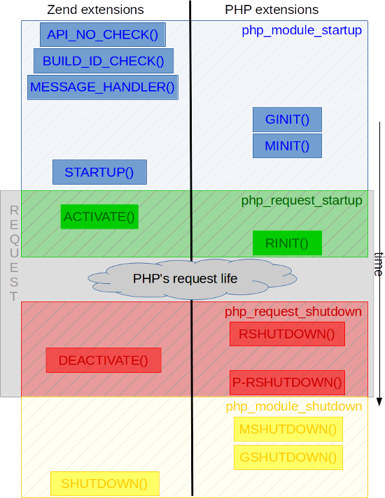

## 扩展开发前言

扩展作用:重新定义PHP行为对PHP进行HACK,提供内部函数或内部类,提升执行性能等

---

### PHP扩展分类
PHP中的扩展分为两类:PHP扩展、Zend扩展,对内核而言这两个分别称之为:模块(module)、扩展(extension),我们主要介绍是PHP扩展,也就是模块.

#### 加载区别:
* PHP扩展(又名PHP“模块”)使用“extension = test.so”行加载到INI文件中
* Zend扩展使用“zend_extension = test.so”行加载到INI文件中

Zend扩展比PHP扩展更复杂,因为它们有更多的钩子,而且更接近Zend引擎及其虚拟机(整个PHP源代码中最复杂的部分).
Zend扩展例子如:OPCache,XDebug,phpdbg,Zend扩展通常用来处理两种任务:调试器和剖析器.如果您的目标是“只是”向PHP 添加一些新概念(函数,类,常量等),那么您将使用PHP扩展,但如果需要更改PHP的当前行为,可能Zend扩展将会更好.

## PHP扩展生命周期


```code
/* Zend扩展结构  -- zend_extension.h */
struct _zend_extension {
    ...                                                     /* 扩展基础信息 */
    startup_func_t startup;                         // STARTUP() */
    shutdown_func_t shutdown;                       // SHUTDOWN() 模块关闭 */
    activate_func_t activate;                       // ACTIVE()  请求启动 */ */
    deactivate_func_t deactivate;                   // DEACTIVATE() 请求关闭 */
    message_handler_func_t message_handler;         // MESSAGE_HANDLER() 在扩展注册后调用 */
    op_array_handler_func_t op_array_handler;               //在脚本编译后(zend compilation)后调用的钩子函数 */
    statement_handler_func_t statement_handler;             /* */
    fcall_begin_handler_func_t fcall_begin_handler;         /* 在处理opcode时调用 */
    fcall_end_handler_func_t fcall_end_handler;             /* */
    op_array_ctor_func_t op_array_ctor;                     /* 构造OPArray时调用 */
    op_array_dtor_func_t op_array_dtor;                     /* 销毁OPArray时调用 */
    int (*api_no_check)(int api_no);                /* API_NO_CHECK() 用来检测扩展是否兼容 */
    int (*build_id_check)(const char* build_id);    /* BUILD_ID_CHECK() */
    ...
    DL_HANDLE handle;                                       /* dlopen()返回句柄 */
    int resource_number;                                    /* 用于管理该扩展名的内部编号 */
};
/* php扩展（模块）结构  -- zend_modules.h */
struct _zend_module_entry {
    ...
    int (*module_startup_func)(INIT_FUNC_ARGS);         /*  MINIT()  模块初始化回调函数,通过PHP_MINIT_FUNCTION()或ZEND_MINIT_FUNCTION()宏完成定义 */
    int (*module_shutdown_func)(SHUTDOWN_FUNC_ARGS);    /*  MSHUTDOWN()  模块关闭阶段回调的函数.,通过PHP_MSHUTDOWN_FUNCTION()或ZEND_MSHUTDOWN_FUNCTION()定义, */
    int (*request_startup_func)(INIT_FUNC_ARGS);        /*  RINIT()  请求开始前回调函数,通过PHP_RINIT_FUNCTION()或ZEND_RINIT_FUNCTION()宏定义. */
    int (*request_shutdown_func)(SHUTDOWN_FUNC_ARGS);   /*  RSHUTDOWN()  请求结束时回调函数,通过PHP_RSHUTDOWN_FUNCTION()或ZEND_RSHUTDOWN_FUNCTION()宏定义 */
    void (*info_func)(ZEND_MODULE_INFO_FUNC_ARGS);      /*  PHPINFO()  php_info展示的扩展信息处理函数,调用phpinfo()时触发此函数 */
    ...
    void (*globals_ctor)(void *global);                  /*  GINIT() This funtion is called to initialize a module's globals before any module_startup_func. */
    void (*globals_dtor)(void *global);                  /*  GSHUTDOWN()  This funtion is called to deallocate a module's globals after any module_shutdown_func. */
    int (*post_deactivate_func)(void);                   /*  PRSHUTDOWN()  晚于RSHUTDOWN调用, post-RSHUTDOWN function */
    ...
};
```
    module_startup/module_shutdown:可用来注册/销毁类,全局变量，INI配置,常量
    request_startup/request_shutdown:可用来注册/销毁特定于每个请求的变量
    
混合扩展可以注册为zend扩展或php模块后，在启动函数（startup或minit）中再注册另一个结构.
```c
#include "php.h"
#include "Zend/zend_extensions.h"
#include "php_pib.h"

#define PRINT(what) fprintf(stderr, what "\n");

/* Declared as static, thus private */
static zend_module_entry pib_module_entry = {
    STANDARD_MODULE_HEADER,
    "pib",
    NULL, /* Function entries */
    PHP_MINIT(pib), /* Module init */
    PHP_MSHUTDOWN(pib), /* Module shutdown */
    PHP_RINIT(pib), /* Request init */
    PHP_RSHUTDOWN(pib), /* Request shutdown */
    NULL, /* Module information */
    "0.1", /* Replace with version number for your extension */
    STANDARD_MODULE_PROPERTIES
};

/* This line should stay commented
ZEND_GET_MODULE(pib)
*/

zend_extension_version_info extension_version_info = {
    ZEND_EXTENSION_API_NO,
    ZEND_EXTENSION_BUILD_ID
};

zend_extension zend_extension_entry = {
    "pib-zend-extension",
    "1.0",
    "PHPInternalsBook Authors",
    "http://www.phpinternalsbook.com",
    "Our Copyright",
    pib_zend_extension_startup,
    pib_zend_extension_shutdown,
    pib_zend_extension_activate,
    pib_zend_extension_deactivate,
    NULL,
    NULL,
    NULL,
    NULL,
    NULL,
    NULL,
    NULL,

    STANDARD_ZEND_EXTENSION_PROPERTIES
};

static void pib_zend_extension_activate(void)
{
    PRINT("Zend extension new request starting up");
}

static void pib_zend_extension_deactivate(void)
{
    PRINT("Zend extension current request is shutting down");
}

static int pib_zend_extension_startup(zend_extension *ext)
{
    PRINT("Zend extension is starting up");

    /* When the Zend extension part will startup(), make it register
       a PHP extension by calling ourselves zend_startup_module() */
    return zend_startup_module(&pib_module_entry);
}

static void pib_zend_extension_shutdown(zend_extension *ext)
{
    PRINT("Zend extension is shutting down");
}

static PHP_MINIT_FUNCTION(pib)
{
    PRINT("PHP extension is starting up");

    return SUCCESS;
}

static PHP_MSHUTDOWN_FUNCTION(pib)
{
    PRINT("PHP extension is shutting down");

    return SUCCESS;
}

static PHP_RINIT_FUNCTION(pib)
{
    PRINT("PHP extension new request starting up");

    return SUCCESS;
}

static PHP_RSHUTDOWN_FUNCTION(pib)
{
    PRINT("PHP extension current request is shutting down");

    return SUCCESS;
}
```

#### zend引擎可修改的全局变量函数指针
```c
/* AST, Zend/zend_ast.h: */
void (*zend_ast_process_t)(zend_ast *ast)
/* Compiler, Zend/zend_compile.h: */
zend_op_array *(*zend_compile_file)(zend_file_handle *file_handle, int type)
zend_op_array *(*zend_compile_string)(zval *source_string, char *filename)
/* Executor, Zend/zend_execute.h: */
void (*zend_execute_ex)(zend_execute_data *execute_data)
void (*zend_execute_internal)(zend_execute_data *execute_data, zval *return_value)
/* GC, Zend/zend_gc.h: */
int (*gc_collect_cycles)(void)
/* TSRM, TSRM/TSRM.h: */
void (*tsrm_thread_begin_func_t)(THREAD_T thread_id)
void (*tsrm_thread_end_func_t)(THREAD_T thread_id)
/* Error, Zend/zend.h: */
void (*zend_error_cb)(int type, const char *error_filename, const uint error_lineno, const char *format, va_list args)
/* Exceptions, Zend/zend_exceptions.h: */
void (*zend_throw_exception_hook)(zval *ex)
/* Lifetime, Zend/zend.h: */
void (*zend_on_timeout)(int seconds)
void (*zend_interrupt_function)(zend_execute_data *execute_data)
void (*zend_ticks_function)(int ticks)
```
## 编码规则
php-src/CODING_STANDARDS
* 用来区别函数行为的数值，除了0,1外，尽量定义为常量.
* 用PHP封装好的函数（emalloc(), efree(), estrdup()）分配内存.
* 变量名和函数名为小写字母加下划线组成,尽量短但不要用缩写.
* 如果是同一父集下的函数，使用parent_*加前缀的命名方法，如(file_get_contents,file_put_contents).
* 类名和类中的方法使用驼峰命名法命名,类名首字母大写，类的方法首字母小写(如 FooBar->getData() ).
* 不要使用`// ...`风格的注释，使用`/* ... */`格式的注释。
* 使用tab缩进(四个空格的空间).
* 变量声明和语句块之间留一个空行, 逻辑语句块之间也要有空行， 函数与函数之间留一到两个空行.
* 预处理语句(例如 #if)必须写在第一列,如果要缩进预处理语句也要把 # 号放在一行的开始, 紧接着是任意数量的空格

## 编译安装PHP
```shell
make clean
./configure --prefix=/home/ll/workspace/C/php-7-1-8-install --disable-all --enable-cli --enable-debug
make -j4
make install
```

#### TODO::扩展的加载，和钩子函数的调用过程


## 编写PHP扩展(模块)的步骤:
1. 通过ext目录下ext_skel脚本生成扩展的基本框架:./ext_skel --extname;
2. 修改config.m4配置:设置编译配置参数、设置扩展的源文件、依赖库/函数检查等等;
3. 编写扩展要实现的功能:按照PHP扩展的格式以及PHP提供的API编写功能;
4. 生成configure:扩展编写完成后执行phpize脚本生成configure及其它配置文件;
5. 编译&安装:./configure、make、make install,然后将扩展的.so路径添加到php.ini中.

``

## PHP扩展(模块)生成和编译
骨架生成器脚本位于php-src/ext/ext_skel中,其使用的模板存储在 php-src/ext/skeleton
### 基本用法
```code
> php-src/ext/ext_skel
./ext_skel --extname=module [--proto=file] [--stubs=file] [--xml[=file]]
          [--skel=dir] [--full-xml] [--no-help]

 --extname=module   module为你的扩展名称 (module is the name of your extension)
 --proto=file       从file原型文件创建一组PHP函数，方便开发基于库的扩展.(file contains prototypes of functions to create)
 --stubs=file           generate only function stubs in file
 --xml                  generate xml documentation to be added to phpdoc-cvs
 --skel=dir         用于指定用一套修改过的框架文件来工作.(path to the skeleton directory)
 --full-xml             generate xml documentation for a self-contained extension
                        (not yet implemented)
 --no-help          指定此参数会造成 ext_skel 会在生成的文件里省略很多有用的注释。do not try to be nice and create comments in the code
                    and helper functions to test if the module compiled

> php-src/ext/ext_skel --extname=pib
> cd php-src/ext
> tree pib/
pib/
├── config.m4       //UNIX 构建系统配置
├── config.w32      //Windows 构建系统配置 
├── CREDITS         //扩展描述文件，包含扩展名，开发者信息。默认生成时只带有扩展名
├── EXPERIMENTAL    //实验功能说明
├── php_pib.h       //包含附加的宏、原型和全局量
├── pib.c           //扩展源文件
├── pib.php         //测试文件
└── tests           //测试脚本目录
    └── 001.phpt    //测试脚本。测试方法：php ../../run-tests.php ./pib/001.phpt (run-tests.php文件存在php源码根目录)
```

#### proto原型文件

原型文件有点类似 C 头文件，根据其中申明的函数，生成函数骨架代码和其他相关代码。如 pib.proto，内容为 `string pib_hello_world (string name)`

原型文件的格式，类似于 C 头文件中的函数申明的方式，返回值、函数名、形参类型、形参名。 参数用 () 包裹，多个参数以 , 分隔，函数申明末尾不需要以 ; 结尾，一行一个函数声明。 

原型文件的生成依赖于 awk 脚本 ext/skeleton/create_stubs ，由其中 convert 函数可知，其支持的参数类型有
```code
int,long
bool,boolean
double,float
string
array,object,mixed
resource,handle
```


## 修改config.m4
config.m4是扩展的编译配置文件,它被include到configure.in文件中,最终被autoconf编译为configure,编写扩展时我们只需要在config.m4中修改配置即可.

首先修改 config.m4 ，去掉 PHP_ARG_ENABLE 和 --enable-pib 这两行前面的 dnl,dnl 是注释符号。修改后如下
```code
PHP_ARG_ENABLE(pib, whether to enable pib support,
dnl Make sure that the comment is aligned:
[  --enable-pib           Enable pib support])
```
PHP_ARG_ENABLE函数第一参数表示扩展名，第二个和第三个在生成configure时的一些提示信息。--enable-extname表示不依赖第三方库，而--with-extname表示需要第三方库。

PHP_NEW_EXTENSION(pib, pib.c, $ext_shared,, -DZEND_ENABLE_STATIC_TSRMLS_CACHE=1)函数声明了这个扩展的名称、需要的源文件名、此扩展的编译形式。
如果是多个文件的话，就在第二个参数后加空格再填写你的源文件地址，需要换行的话记得反斜杠\。

### config.m4常用宏
PHP在acinclude.m4中基于autoconf/automake的宏封装了很多可以直接使用的宏,下面介绍几个比较常用的宏:
* `PHP_ARG_WITH(arg_name,check message,help info)`: 定义一个--with-feature[=arg]这样的编译参数,调用的是autoconf的AC_ARG_WITH,这个宏有5个参数,常用的是前三个,分别表示:参数名、执行./configure是展示信息、执行--help时展示信息,第4个参数为默认值,如果不定义默认为"no",通过这个宏定义的参数可以在config.m4中通过$PHP_参数名(大写)访问.比如:PHP_ARG_WITH(aaa, aaa-configure, help aa)后面通过$PHP_AAA就可以读取到--with-aaa=xxx设置的值了
* `PHP_ARG_ENABLE(arg_name,check message,help info)`: 定义一个--enable-feature[=arg]或--disable-feature参数,--disable-feature等价于--enable-feature=no,这个宏与PHP_ARG_WITH类似,通常情况下如果配置的参数需要额外的arg值会使用PHP_ARG_WITH,而如果不需要arg值,只用于开关配置则会使用PHP_ARG_ENABLE.
* `AC_MSG_CHECKING()/AC_MSG_RESULT()/AC_MSG_ERROR()`: ./configure时输出结果,其中error将会中断configure执行.
* `AC_DEFINE(variable, value, [description])`: 定义一个宏,比如:AC_DEFINE(IS_DEBUG, 1, []),执行autoheader时将在头文件中生成:#define IS_DEBUG 1.
* `PHP_ADD_INCLUDE(path)`: 添加include路径,即:gcc -Iinclude_dir,#include "file";将先在通过-I指定的目录下查找,扩展引用了外部库或者扩展下分了多个目录的情况下会用到这个宏.
* `PHP_CHECK_LIBRARY(library, function [, action-found [, action-not-found [, extra-libs]]])`: 检查依赖的库中是否存在需要的function,action-found为存在时执行的动作,action-not-found为不存在时执行的动作,比如扩展里使用到线程pthread,检查pthread_create(),如果没找到则终止./configure执行:
```code
    PHP_ADD_INCLUDE(pthread, pthread_create, [], [
        AC_MSG_ERROR([not find pthread_create() in lib pthread])
    ])
```
* `AC_CHECK_FUNC(function, [action-if-found], [action-if-not-found])`: 检查函数是否存在. (8)PHP_ADD_LIBRARY_WITH_PATH($LIBNAME, $XXX_DIR/$PHP_LIBDIR, XXX_SHARED_LIBADD): 添加链接库.
* `PHP_NEW_EXTENSION(extname, sources [, shared [, sapi_class [, extra-cflags [, cxx [, zend_ext]]]]])`: 注册一个扩展,添加扩展源文件,确定此扩展是动态库还是静态库,每个扩展的config.m4中都需要通过这个宏完成扩展的编译配置.

更多autoconf及PHP封装的宏大家可以在用到的时候再自行检索,同时ext目录下有大量的示例可供参考.
[参考链接](https://secure.php.net/manual/en/internals2.buildsys.configunix.php)


## 编译安装测试扩展
```shell
cd ext/pib
../../../php-7-1-8-install/bin/phpize
./configure --with-php-config=../../../php-7-1-8-install/bin/php-config
make

cd ../../sapi/cli
./php -d extension='../../ext/pib/modules/pib.so' -r "echo confirm_pib_compiled('hello world');"
```

在扩展目录（ext/pib/）中，phpize会根据config.m4生一个configure文件.

执行./configure后会生makefiles文件，再执行make . 然后扩展中modules目录下会发现一个pib.so文件 .

make install 会将扩展复制到PHP安装路径的扩展目录当中 。

测试会输出Congratulations! You have successfully modified ext/pib/config.m4. Module hello world is now compiled into PHP.


### 发布前执行
`phpize --clean`


## 参考资料:
    http://www.phpinternalsbook.com/index.html
    https://github.com/pangudashu/php7-internal/
    https://secure.php.net/manual/en/internals2.structure.php
    http://www.laruence.com/2009/04/28/719.html
    https://andot.gitbooks.io/bped/c02s03.html
    https://github.com/lxy254069025/php-extension-book
    http://php.net/manual/zh/internals2.buildsys.configunix.php
    http://www.php-internals.com/book/?p=chapt11/11-02-00-extension-hello-world


